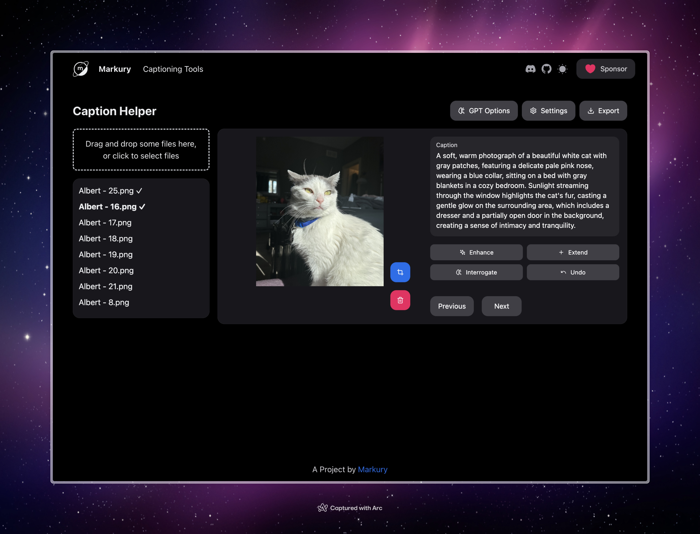

# Caption Helper

Caption Helper is a simple tool designed to assist in creating, managing, and enhancing captions for images, particularly for use in Stable Diffusion training. 

## Preview




## Features

- Image upload: Drag and drop or select multiple images
- Caption editing: Manually edit captions for each image
- AI-powered caption enhancement:
  - Enhance: Improve existing captions
  - Extend: Add more details to captions
  - Interrogate: Generate new captions based on image content
- Image management: Delete unwanted images
- Image cropping: Adjust image framing
- Export: Save captions (and optionally images) as a ZIP file

## How to Use

### Getting Started

1. Clone the project or use the live version at [https://sd-caption-helper.vercel.app/](https://sd-caption-helper.vercel.app/).
2. Click the "Settings" button to add your API keys:
   - Groq API key (for enhance and extend features)
   - OpenAI API key (for the interrogate feature)

### Uploading Images

1. Drag and drop images onto the upload area, or click to select files from your device.
2. Uploaded images will appear in the sidebar on the left.

### Editing Captions

1. Click on an image in the sidebar to select it.
2. The selected image will appear in the main view along with its caption.
3. Edit the caption directly in the text box provided.

### Using AI Features

For each image, you can use the following AI-powered features:

- **Enhance**: Click to improve the existing caption.
- **Extend**: Click to add more details to the current caption.
- **Interrogate**: Click to generate a new caption based on the image content.

### Image Management

- **Delete**: Remove the current image from your collection.
- **Crop**: Adjust the framing of the current image.

### Navigation

Use the navigation buttons to move between images in your collection.

### GPT Options

Click the "GPT Options" button to set:

- Custom Token: A specific token to include in generated captions.
- Custom Instruction: Additional instructions for the AI when generating captions.
- Inherent Attributes: Attributes to avoid in generated captions.

### Exporting

1. Click the "Export" button.
2. Choose whether to include images in the export.
3. Optionally, choose to rename images sequentially and set a prefix.
4. Click "Export" to download a ZIP file containing your captions (and images if selected).

# Caption Helper - Development Guide

This document provides technical details about the Caption Helper project, including setup instructions, architecture overview, and implementation details of key features.

## Tech Stack

- Next.js 13+ (App Router)
    - [Next.js 14](https://nextjs.org/docs/getting-started)
    - [NextUI v2](https://nextui.org/)
    - [Tailwind CSS](https://tailwindcss.com/)
    - [Tailwind Variants](https://tailwind-variants.org)
    - [TypeScript](https://www.typescriptlang.org/)
    - [Framer Motion](https://www.framer.com/motion/)
    - [next-themes](https://github.com/pacocoursey/next-themes)
- React
- TypeScript
- NextUI for UI components
- Tailwind CSS for styling
- react-dropzone for file uploads
- react-easy-crop for image cropping
- JSZip for creating ZIP files
- Groq API for caption enhancement and extension
- OpenAI API (GPT-4o) for image interrogation
- Ollama API for local image interrogation

## Project Structure

```
caption-helper/
📦app
 ┣ 📂api
 ┣ ┃ 📂available-models
 ┃ ┃ ┗ 📜route.ts
 ┃ ┣ 📂gpt-interrogate
 ┃ ┃ ┗ 📜route.ts
 ┃ ┣ 📂groq-enhance
 ┃ ┃ ┗ 📜route.ts
 ┃ ┗ 📂groq-extend
 ┃ ┃ ┗ 📜route.ts
 ┃ ┣ ollama-interrogate
 ┃ ┃ ┗ 📜route.ts
 ┣ 📂blank-page
 ┃ ┣ 📜layout.tsx
 ┃ ┗ 📜page.tsx
 ┣ 📜error.tsx
 ┣ 📜layout.tsx
 ┣ 📜page.tsx
 ┗ 📜providers.tsx
 📦components
 ┣ 📜CaptionEditor.tsx
 ┣ 📜ExportOptionsModal.tsx
 ┣ 📜GptOptionsModal.tsx
 ┣ 📜ImageViewer.tsx
 ┣ 📜Navigation.tsx
 ┣ 📜Settings.tsx
 ┣ 📜Sidebar.tsx
 ┣ 📜icons.tsx
 ┣ 📜navbar.tsx
 ┣ 📜primitives.ts
 ┗ 📜theme-switch.tsx
 📦config
 ┣ 📜fonts.ts
 ┗ 📜site.ts
 📦lib
 ┣ 📜types.ts
 ┗ 📜utils.ts
```

## Setup and Installation

1. Clone the repository:
   ```
   git clone https://github.com/markuryy/caption-helper.git
   cd caption-helper
   ```

2. Install dependencies:
   ```
   bun i
   ```

3. Create a `.env.local` file in the root directory and add your API keys:
   ```
   GROQ_API_KEY=your_groq_api_key
   OPENAI_API_KEY=your_openai_api_key
   ```

4. Run the development server:
   ```
   bun dev
   ```

## Key Features Implementation

### Image Upload

- Uses `react-dropzone` for handling file uploads.
- Implemented in `app/page.tsx` within the `onDrop` function.
- Processes uploaded files using the `processUploadedFiles` utility function.

### Caption Editing

- Implemented in the `CaptionEditor` component.
- Uses controlled input for real-time updates.

### AI-powered Caption Enhancement

- Implemented in `app/page.tsx` within the `handleCaptionAction` function.
- Uses separate API routes for each action:
  - `app/api/groq-enhance/route.ts` for enhancing captions
  - `app/api/groq-extend/route.ts` for extending captions
  - `app/api/gpt-interrogate/route.ts` for generating captions from images
  - `app/api/ollama-interrogate/route.ts` for generating captions from images using Ollama

### Image Cropping

- Uses `react-easy-crop` library.
- Implemented in the `ImageViewer` component.

### Export Functionality

- Implemented in `app/page.tsx` within the `handleExport` function.
- Uses `JSZip` to create ZIP files containing captions and optionally images.
- Export options are managed through the `ExportOptionsModal` component.

### State Management

- Uses React's `useState` hook for local state management.
- Global states (like API keys) are stored in localStorage and managed through the `Settings` component.

## API Integration

### Groq API

- Used for caption enhancement and extension.
- API calls are made from the server-side API routes to protect API keys.

### OpenAI API (GPT-4o)

- Used for image interrogation (generating captions from images).
- Implemented in `app/api/gpt-interrogate/route.ts`.
- Uses the selected model for omni-modal capabilities.

### Ollama API

- Used for image interrogation (generating captions from images).
- Implemented in `app/api/ollama-interrogate/route.ts`.
- Uses the selected model for omni-modal capabilities.

## Image Processing

- Client-side image downscaling is implemented in `lib/utils.ts` using the `downscaleImage` function.
- This ensures that large images are properly handled when sent to the GPT-4o API.

## Styling

- Uses a combination of NextUI components and Tailwind CSS for styling.
- Global styles are defined in `styles/globals.css`.

## Future Development

- Consider implementing server-side session storage for better state management across page reloads.
- Explore options for batch processing of images for more efficient handling of large collections.
- Implement user authentication to allow for saved projects and user-specific settings.

## Contributing

1. Fork the repository.
2. Create a new branch for your feature or bug fix.
3. Make your changes and commit them with descriptive commit messages.
4. Push your changes to your fork.
5. Submit a pull request to the main repository.

Please ensure that your code follows the existing style conventions and includes appropriate tests.

## Tips for Stable Diffusion Training

- Use clear, descriptive captions that accurately represent the image content.
- Include relevant details but avoid overly specific or unique identifiers.
- Experiment with the AI enhancement features to generate diverse captions.
- Use the custom token and instruction features to tailor captions to your specific training needs.

## Support

For issues, feature requests, or contributions, please visit the [GitHub repository](https://github.com/markuryy/caption-helper).
